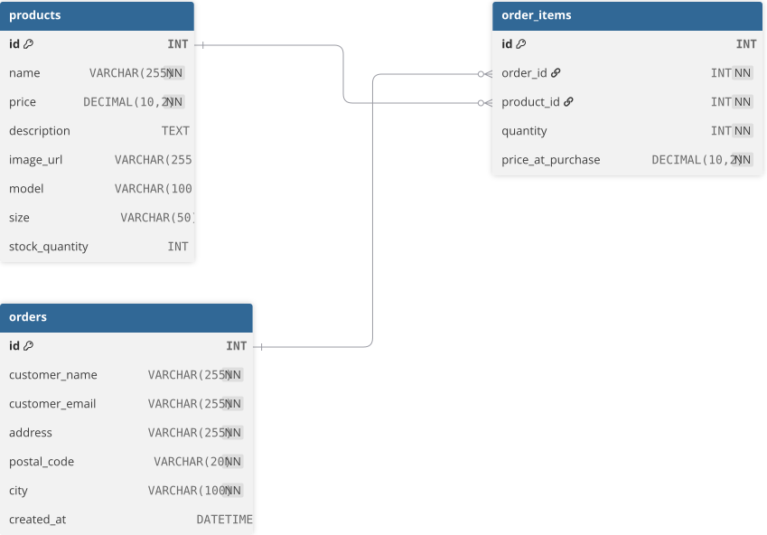

# Databas-diagram

Tre tabeller: `products`, `orders` och `order_items`. En order kan innehålla flera produkter, och en produkt kan finnas i flera ordrar — därför en koppling via `order_items` (junction table) mellan dem.



## SQL för att skapa tabellerna
```sql
CREATE TABLE products (
    id INT AUTO_INCREMENT PRIMARY KEY,
    name VARCHAR(255) NOT NULL,
    price DECIMAL(10, 2) NOT NULL,
    description TEXT,
    image_url VARCHAR(255),
    model VARCHAR(100),
    size VARCHAR(50),
    stock_quantity INT DEFAULT 0
);

CREATE TABLE orders (
    id INT AUTO_INCREMENT PRIMARY KEY,
    customer_name VARCHAR(255) NOT NULL,
    customer_email VARCHAR(255) NOT NULL,
    address VARCHAR(255) NOT NULL,
    postal_code VARCHAR(20) NOT NULL,
    city VARCHAR(100) NOT NULL,
    created_at DATETIME DEFAULT CURRENT_TIMESTAMP
);

CREATE TABLE order_items (
    id INT AUTO_INCREMENT PRIMARY KEY,
    order_id INT NOT NULL,
    product_id INT NOT NULL,
    quantity INT NOT NULL,
    price_at_purchase DECIMAL(10, 2) NOT NULL,
    FOREIGN KEY (order_id) REFERENCES orders(id),
    FOREIGN KEY (product_id) REFERENCES products(id)
);
```
